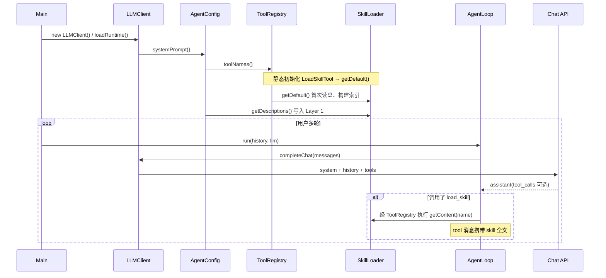

# Agent03：按需技能加载（Skills）与双层提示词

包 **`com.learn.javaagent.Agent03`** 在 Agent02「多工具 + Todo 规划 + 提醒注入」的基础上，新增 **`skills` 模块** 与 **`load_skill` 工具**，实现 **「第一层：系统提示只列技能索引；第二层：通过 tool 结果按需注入完整说明」**，避免把长篇技能全文塞进 system prompt。

---

## 1. Agent02 与 Agent03 的差异概览

| 维度 | Agent02 | Agent03 |
|------|---------|---------|
| **技能与知识** | 无独立技能层；知识仅依赖模型权重与对话历史。 | 磁盘上的 **`SKILL.md`** 技能库；**索引进 system**，**正文走 tool_result**。 |
| **配置** | `API_KEY`、`MODEL_ID`、`API_BASE_URL` 等。 | 同上，另增 **`SKILLS_DIR`**（默认 `agent03/skills`），见 `AgentConfig`。 |
| **标准工具** | `bash`、`read_file`、`write_file`、`edit_file`、`todo`。 | 在 `edit_file` 与 **`todo` 之间** 增加 **`load_skill`**（见 `ToolRegistry`）。 |
| **`systemPrompt()`** | 工作目录 + 工具名列表 + todo 使用约定。 | 额外说明 **须通过 `load_skill(name)` 拉取全文**；若磁盘上存在技能，追加 **`Skills available:`** 多行列表（仅 **name + 短描述**）。 |
| **`AgentLoop` / `LLMClient` / `Main`** | 行为与 Agent03 对应类 **一致**（仅包名不同）。 | 与 Agent02 逻辑等价；技能注入不改变循环结构，仅多一种工具返回类型。 |

**结论**：Agent03 = Agent02 运行时骨架 + **技能目录扫描** + **`load_skill` 分发** + **双层提示词约定**。未改「Chat Completions → tool_calls → tool 消息」的主路径。

---

## 2. Skills 模块要解决什么问题

- **问题**：若把每个技能的完整流程（数千 token）全部写入 system prompt，会 **固定占用上下文**，且多数轮次用不到。
- **做法**（与本仓库实现一致）：
  - **Layer 1（常驻）**：system 中只保留 **技能标识 + 一行 description**（来自 frontmatter），体量小，便于模型做路由。
  - **Layer 2（按需）**：模型在需要时发起 **`load_skill`**，服务端把 **完整 Markdown 正文** 包在 **`<skill name="...">...</skill>`** 里，作为 **`role: tool` 的 `content`** 返回，等价于 **通过 tool_result 注入知识**，而不是塞进 system。

---

## 3. 磁盘约定与元数据

- **根目录**：由 **`AgentConfig.skillsDirectory()`** 解析，来源为 classpath 中的 **`agent.properties`** 与环境变量（环境变量覆盖文件），键名 **`SKILLS_DIR`**；未配置时使用 **`DEFAULT_SKILLS_DIR`**（`agent03/skills`），再 **`Paths.get(...).toAbsolutePath().normalize()`**。
- **每个技能一个子目录**，目录内必有 **`SKILL.md`**（递归扫描时匹配文件名 `SKILL.md`，大小写不敏感）。
- **YAML Frontmatter**（`---` 与 `---` 之间）：当前实现支持 **简单单行 `key: value`**（见 `YamlFrontmatter`）。常用键：
  - **`name`**：技能在索引与 `load_skill` 中使用的 **逻辑名**；若省略或为空，则使用 **含 `SKILL.md` 的父目录名**。
  - **`description`**：出现在 **Layer 1** 列表中的 **简短说明**。
- **正文**：第二个 `---` 之后的 Markdown 为 **技能全文**，仅在 **`SkillLoader#getContent`** / **`load_skill`** 时进入对话。

示例布局（仓库内可参考）：

```text
agent03/skills/
  git/SKILL.md
  test/SKILL.md
  code-review/SKILL.md
```

---

## 4. 核心类与职责

| 类 | 职责 |
|----|------|
| **`SkillLoader`** | 进程内 **单例**（`getDefault()`）：扫描技能根目录、解析每个 `SKILL.md`、构建 **name → `SkillEntry`** 映射；提供 **`getDescriptions()`**（Layer 1 文本）与 **`getContent(name)`**（Layer 2 XML 包装）。 |
| **`YamlFrontmatter`** | 将文件拆成 **meta（Map）** 与 **body（String）**；meta 为轻量键值解析。 |
| **`SkillEntry`** | 不可变：**meta** + **body**。 |
| **`LoadSkillTool`** | 工具名 **`load_skill`**；参数 **`name`**；执行时调用 **`SkillLoader#getContent`**，返回值写入 **tool 消息**。 |

---

## 5. 加载顺序与初始化时机（重要）

下列顺序有助于理解「何时读盘、何时构造 system、何时出现单例」。

### 5.1 进程启动（典型：`Main` → `new LLMClient()` → `AgentConfig.loadRuntime()`）

1. **`loadRuntime()`** 在构造 **`RuntimeConfig`** 时调用 **`AgentConfig.systemPrompt()`**，需要生成 **整段 system 字符串**。
2. **`systemPrompt()` 内部首先** 使用 **`ToolRegistry.toolNames()`** 拼接工具名列表。
3. **首次访问 `ToolRegistry`** 会触发其 **静态初始化**：构建 **`STANDARD_DECLARATIONS`**，其中包含 **`new LoadSkillTool(SkillLoader.getDefault())`**。
4. 因而在拼接「工具名」阶段就会 **第一次调用 `SkillLoader.getDefault()`**：
   - 双检锁创建 **单例**；
   - 内部 **`new SkillLoader(AgentConfig.skillsDirectory())`**；
   - **`skillsDirectory()`** 调用 **`AgentConfig.load()`** 读取 **`agent.properties` 与 `System.getenv`**，得到 **`SKILLS_DIR`**；
   - **`loadAll`**：若根路径 **不是目录**则 **零技能**；否则 **`Files.walk`** 找所有 **`SKILL.md`**，读入并解析，装入 **`Map`**（此过程在 **单例首次创建时执行一次**）。
5. **`systemPrompt()` 随后** 再调用 **`SkillLoader.getDefault().getDescriptions()`**，把 **Layer 1** 追加到 system（若列表为空则 **不追加 `Skills available` 块**）。

### 5.2 请求与多轮对话（`LLMClient.completeChat` + `AgentLoop.run`）

- 每条 Chat 请求仍由 **`LLMClient`** 在消息数组 **首部插入同一段 system**（来自 **`RuntimeConfig`**，在 **`loadRuntime()` 时已固定快照）。
- **技能全文不会**在每次请求时自动重载；**磁盘仅在 `SkillLoader` 单例首次初始化时读一次**（当前实现）。  
  **「按需」** 指 **模型是否调用 `load_skill`**，而非「每次从磁盘懒加载」。
- 当模型在 **`tool_calls`** 中调用 **`load_skill`** 时，**`ToolExecutor`** 委托 **`LoadSkillTool`**，返回的字符串作为 **`role: tool` 的 `content`** 进入 **后续轮次**的上下文。



---

## 6. 提示词设计（Layer 1 / Layer 2）

### 6.1 Layer 1：system（始终附带，体量小）

- **身份与能力**：仍为「在某工作目录下的 coding agent」，并列出 **全部标准工具名**（含 **`load_skill`**）。
- **明确契约**：英文说明——需要某技能的 **完整说明** 时，应调用 **`load_skill(name)`**，详细内容在 **tool result**，**不在** 当前 system 段。
- **条件块 `Skills available:`**：仅当 **`getDescriptions()` 非空** 时追加，格式为：

```text
Skills available:
  - <name>: <description>
  ...
```

每一行对应磁盘上的一个技能；**description 来自 frontmatter**，缺失则为空字符串。

### 6.2 Layer 2：tool（按需）

- **`load_skill`** 的 **`function.arguments`** 中传入 **`name`**（与 Layer 1 列表中的标识一致）。
- **返回内容** 为 XML 风格包裹（便于模型与日志识别边界），形如：

```text
<skill name="git">
... Markdown 正文 ...
</skill>
```

- **`name` 属性** 会做 **XML 属性转义**；正文 **不**做 HTML 转义，以保持 Markdown 可读性。
- **未知技能** 返回 **`Error: Unknown skill '...'.`** 文本，同样经 tool 通道回到模型。

### 6.3 与 Todo 提醒的关系

- **`AgentLoop`** 中「多轮未调用 **todo** 则注入提醒」的逻辑 **未变**；若某轮同时存在 **nag 提醒** 与 **`load_skill` 结果**，提醒会 **追加在某一 tool 消息的 content 末尾**（与 Agent02 相同策略），**不**写入 system。

---

## 7. 配置项小结

| 键 / 常量 | 含义 |
|-----------|------|
| **`SKILLS_DIR`** | 技能根目录；可在 **`agent.properties`** 或环境变量中设置；未设置则用 **`agent03/skills`**（相对 **进程当前工作目录** 解析为绝对路径）。 |
| **`SkillLoader.getDefault()`** | 单例；解析失败或 IO 异常时退化为 **空技能表**（不阻塞进程启动）。 |

---

## 8. 小结

- **Agent03** 在 **Agent02** 的 **工具链与循环** 上增加 **技能索引 + `load_skill` 注入全文** 的能力。
- **原理**：**索引在 system，知识在 tool**，从而控制 **固定上下文长度**，并按模型决策 **选择性展开** 技能正文。
- **加载顺序**：**`loadRuntime` → `systemPrompt` → `ToolRegistry` 静态初始化 → `SkillLoader` 单例首次读盘 → `getDescriptions` 写入 system**；对话中 **按需** 通过 **`load_skill`** 把 **Layer 2** 写入历史。

---

*文档对应代码版本以仓库 `com.learn.javaagent.Agent03` 包为准。*
